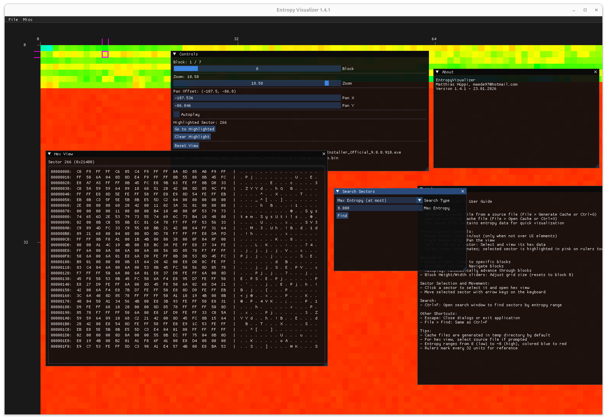

# Entropy Visualizer



A tool for visualizing file entropy through an interactive GUI. Analyze data distribution patterns in files by calculating Shannon entropy for each sector and displaying it as a color-coded heatmap.

## Features

- **Interactive Entropy Visualization**: Visualize Shannon entropy as a color-coded grid (blue for low entropy, red for high entropy)
- **File Caching**: Generate and load cache files for fast visualization of large files
- **Zoom and Pan**: Mouse controls for detailed inspection
- **Sector Selection**: Click sectors to view hex data
- **Search Functionality**: Find sectors by entropy range
- **Autoplay Mode**: Automatically advance through file blocks
- **Drag & Drop**: Support for dropping files directly into the application
- **Cross-Platform**: Windows and Linux support

## Prerequisites

- **CMake** (3.14 or later)
- **C++17 compatible compiler** (GCC, Clang, MSVC)
- **OpenGL** development libraries
- **Git** (for submodule initialization)

## Dependencies

This project uses the following libraries (included as submodules):
- [GLFW](https://github.com/glfw/glfw) - Window and input handling
- [ImGui](https://github.com/ocornut/imgui) - Immediate mode GUI
- [GLAD](https://github.com/Dav1dde/glad) - OpenGL function loading (not included as a submodule but in-place)
- [ImGuiFileDialog](https://github.com/aiekick/ImGuiFileDialog) - File selection dialogs

## Building

### Initialize Submodules
```bash
git submodule update --init --recursive
```

### Linux/macOS
```bash
mkdir build
cd build
cmake .. -DCMAKE_BUILD_TYPE=Release
make
```

### Windows (Visual Studio)
```bash
mkdir build
cd build
cmake .. -G "Visual Studio 16 2019"
msbuild EntropyVisualizer.sln /p:Configuration=Release
```

The executable will be created in the `build` directory.

## Usage

### Getting Started
1. **Generate Cache**: Open a file (File > Generate Cache or Ctrl+G) to create an entropy cache
2. **Open Cache**: Load an existing cache file (File > Open Cache or Ctrl+O) for quick visualization
3. **Visualize**: Use mouse controls to zoom, pan, and select sectors

### Controls

#### Mouse Controls
- **Wheel**: Zoom in/out (when not over UI elements)
- **Right Drag**: Pan the view
- **Left Click**: Select sector and view hex data

#### Keyboard Shortcuts
- **Ctrl+G**: Generate cache from file
- **Ctrl+O**: Open cache file
- **Ctrl+F**: Search sectors by entropy range
- **Arrow Keys**: Move selected sector
- **Escape**: Close dialogs or exit

#### Navigation
- **Block Slider**: Jump to specific blocks
- **Prev/Next Buttons**: Navigate through blocks
- **Autoplay**: Automatically advance blocks
- **Block Height/Width**: Adjust grid dimensions

### Entropy Scale
- **Blue**: Low entropy (0)
- **Green**: Medium entropy
- **Yellow**: Higher entropy
- **Red**: High entropy (~8)

## File Formats

- **Cache Files**: Binary files containing pre-computed entropy data (.cache.bin extension)
- **Supported Input**: Any file format

## Tips

- Cache files are stored in the system temp directory by default
- For hex view, ensure the original source file is accessible
- Rulers mark every 32 units for coordinate reference
- Selected sectors are highlighted in pink on rulers

## Contributing

Contributions are welcome! Please feel free to submit issues and pull requests.

## License

This project is open source. Please check individual dependency licenses for their respective terms.